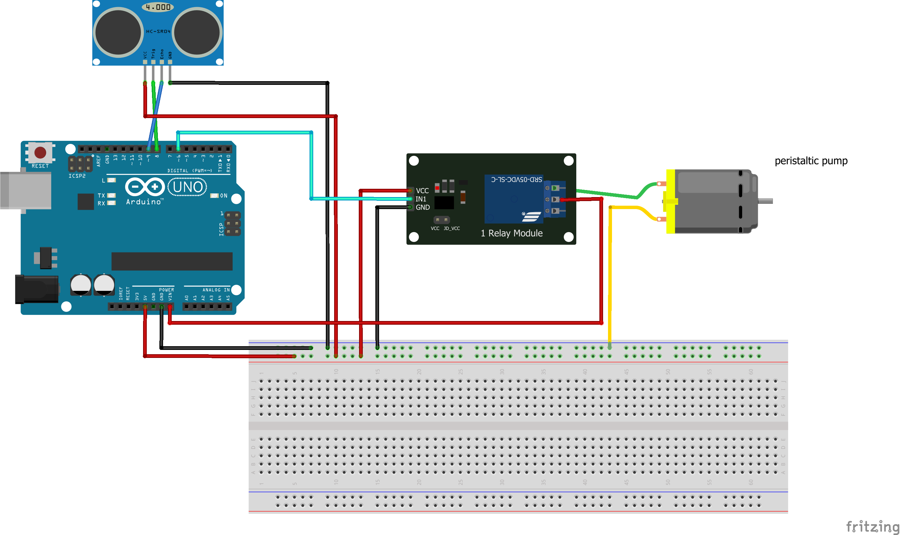

# YAWS: Yet Another Watering System
I started growing carnivore plants indoor and the require daily watering .. so here we go!
## the hardware
Component list:
* Arduino
* Power supply: 12V DC
* relay 1-module
* ultrasonic distance sensor
* peristaltic pump

## the software