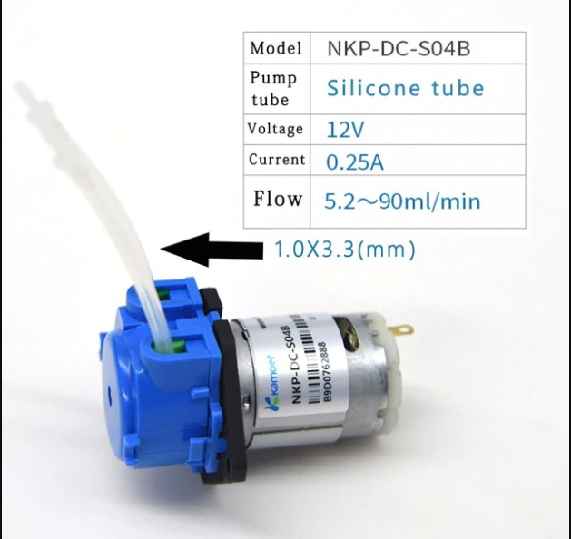
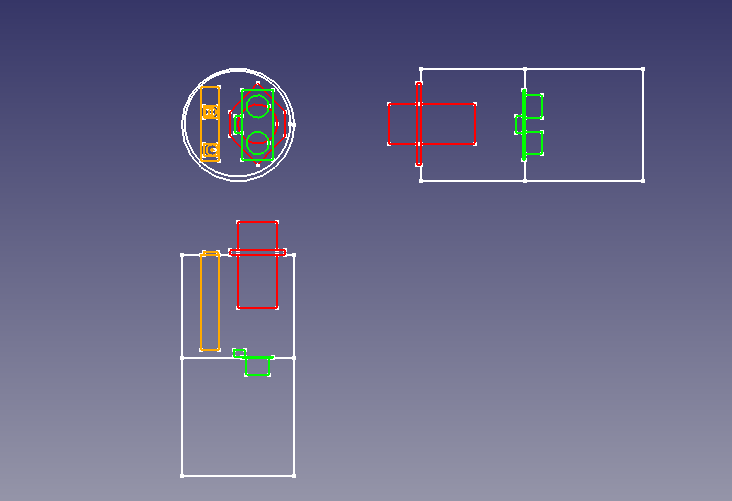
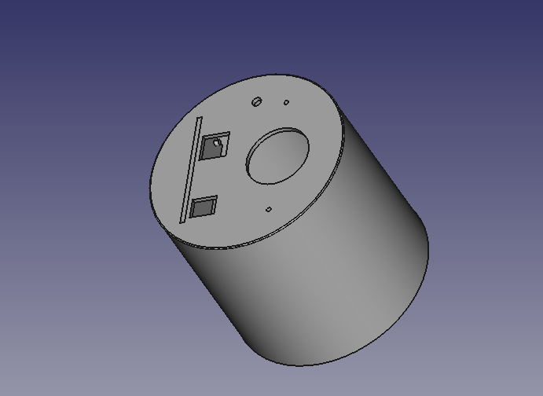
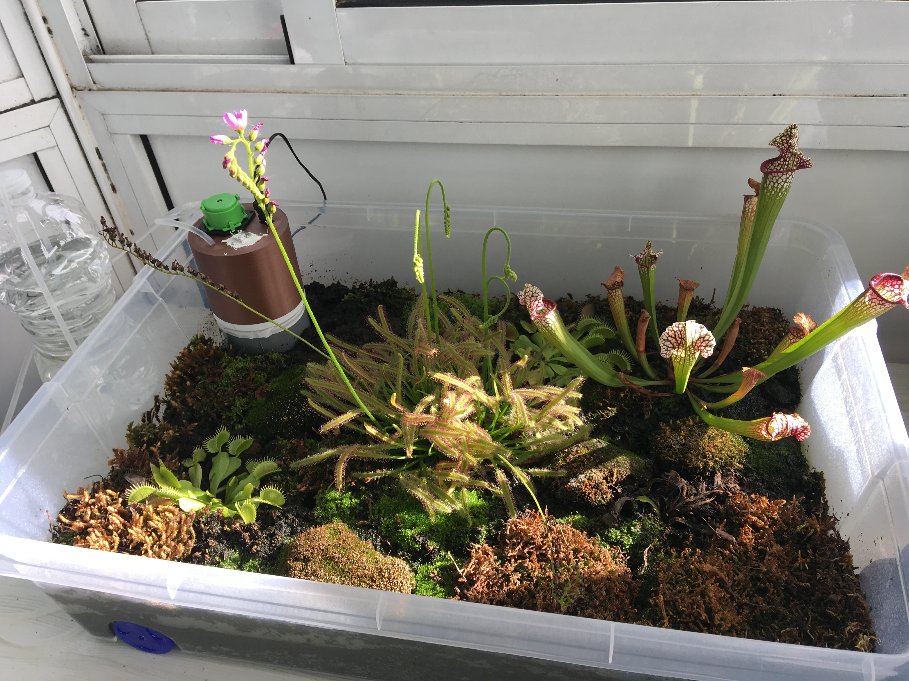

# YAWS: Yet Another Watering System
I started growing carnivorous plants indoor and they have some special requirements. Daily watering with disttilled or rain water (avoiding tap water!) .. so here we go!
## electronics
* Arduino
* Power supply: 12V DC
* relay 1-module
* ultrasonic distance sensor
* peristaltic pump

Use a 12V DC peristaltic pump from aliexpress like this one. Ensure the power needed by the pump is the same you're using in the arduino (you'll power the pump using Vin/GND). The more voltage you power your arduino shield the better because arduino will deal with less current for the same work amount.

## casing
We're going to use a standard 75mm PVC water pipe, with a plug where the ultrasonic sensor will be installed pointing downwards.
The upper chamber is 3d printed and it will fit all the electronic components while keeping them safe from the water.

## software
Just an infinite loop which will turn on the pump for 2 minutes only if the water level is low enought. Then it will wait for 1 day and re-check.

## final comments
I had to split the 24h delay loop into 24x 1 hour delays because of the unsigned int limit. The other option was including a RTC module which allow to use more complex scheduling but adding additional size.
